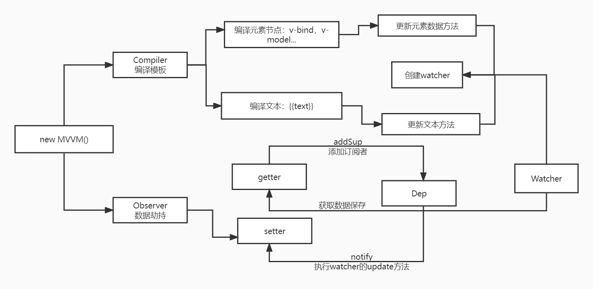
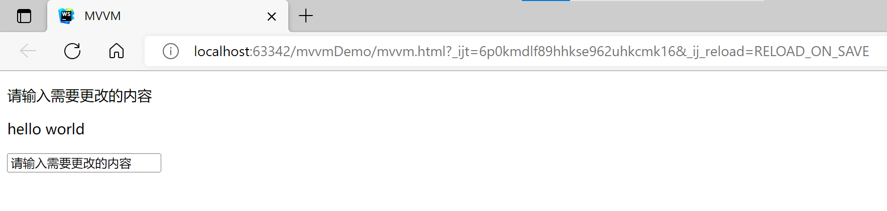
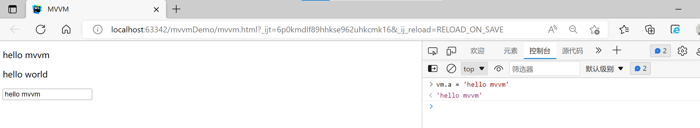
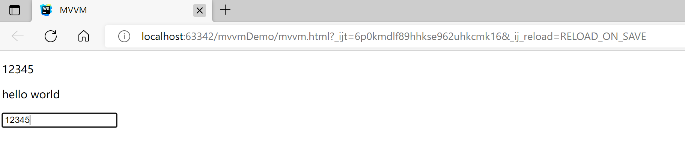

### 实现一个简单的MVVM框架

[toc]


#### 一.设计思路



MVVM框架由Model-View-ViewModel三部分组成，框架的核心是双向数据绑定，即View中的数据变化会自动反映到ViewModel上，Model中数据变化也将会自动在页面上更新。ViewModel将Model和View关联起来，把Model的数据同步到View上显示出来，并将对View的修改同步回Model。

**本次大作业参考vue.js的设计方法，采用数据劫持和发布者-订阅者模式的方式实现数据的双向绑定。具体实现分为以下几个方面：**

1. 指令解析器Compiler：扫描和解析元素节点的指令进行，根据模板替换数据并绑定相应的更新函数
2. 数据监听器Observer：监听数据对象的所有属性，如果发生变化将获取更新后的属性值并通知所有订阅者
3. 观察者Watcher：连接Observer和Compiler，订阅并接收每个属性变动的通知，执行指令绑定的相应回调函数，实现更新视图
4. 框架MVVM：把所有的data数据代理到Mvvm对象上，整合Compiler，Observer和Watcher


#### 二.关键部分的具体实现

##### 1.实现指令解析器Compiler

主要负责解析模板指令，将模板中的变量替换成数据，初始化渲染页面视图，将每个指令对应的节点绑定更新函数，添加监听数据的订阅者，如果数据有变动，收到通知后更新视图

主要操作：通过文档片段将DOM保存到内存，实现编译的核心函数

```javascript
constructor(el,vm){
	vm.$el = document.querySelector(el);
    //为了避免每操作一次都要从页面获取元素，通过文档片段将DOM保存到内存
    let fragment = document.createDocumentFragment();
    let child;
    while(child = vm.$el.firstChild){
    //不断遍历DOM，添加到文档片段中
    //注意：添加的过程中会从文档树中移除该节点，该节点会从浏览器上消失
    	fragment.appendChild(child);
    }
    //实现编译的核心函数。
    this.replace(fragment,this,vm);
    //把更新后的文档片段插入回DOM，达到更新视图的目的
    vm.$el.appendChild(fragment);
}
```

编译编译的核心函数：将节点集合转换为数组，逐个判断是否是元素节点/文本节点。如果是元素节点，判断元素里是否有v-model属性，取出当前节点的属性

```javascript
			if(node.nodeType === 3 && reg.test(text)){
                // RegExp.$1获取到 b.b , 并通过.转换成数组
                let arr = RegExp.$1.split('.');
                let val = vm;
                arr.forEach(function (k) {
                    val = val[k];
                });
                //创建一个watcher对象，用于后期视图动态更新
                new Watcher(vm,RegExp.$1,function (newVal) {
                    node.textContent = text.replace(reg,newVal);
                });
                //更新视图
                node.textContent = text.replace(reg,val);
            }
```

如果是文本节点，取{{}}，判断文本节点中的{{}}，通过正则表达式匹配

```javascript
			if(node.nodeType === 1){
                //判断元素里是否有v-model属性，取出当前节点的属性
                let nodeAttrs = node.attributes;
                Array.from(nodeAttrs).forEach((attr)=>{
                    let name = attr.name;
                    let exp = attr.value;
                    //实现把a的值添加到input输入框内
                    if(name.startsWith('v-')){
                        node.value = vm[exp];
                    }
                    //创建一个watcher对象，用于动态更新视图
                    new Watcher(vm,exp,function (newVal) {
                        node.value = newVal; //更新输入框的值
                    });
                    //输入框添加事件
                    node.addEventListener('input',function (e) {
                        //调用数据劫持中的set方法，触发 dep.notify()
                        vm[exp] = e.target.value;
                    },false);
                })
            }			
```


##### 2.实现数据监听器Observer

主要负责监听数据对象的所有属性，如果发生变化将获取更新后的属性值并通知所有订阅者

```javascript
 	constructor(data){
        this.deepObserve(data);
    }

    deepObserve(data){
        //创建一个可观察对象，每个变化的数据都会对应一个数组，存放所有更新的操作
        let dep = new Dep();
        for(let key in data){
            let value = data[key];
            //深度递归劫持
            Observe.observeData(value);
            //数据劫持主体方法
            this.mount(data,key,value,dep);
        }
    }
```

利用defineProperty()监听属性变动，将数据中原有的属性改成get和set的形式，当Dep.target = watcher 存在的时候，添加到可观察对象数组中

```javascript
	mount(data,key,value,dep){
        //data中的数据递归的通过defineProperty方式创建
        Object.defineProperty(data,key,{
            enumerable:true,
            get(){
                //Dep.target存在的时候，添加到可观察对象数组中
                Dep.target && dep.addSub(Dep.target);
                return value;
            },
            set(newVal){
                if(newVal === value){
                    return;
                }
                value = newVal;
                //手动设置的值也需要劫持
                Observe.observeData(newVal);
                dep.notify();
            }
        })
    }

    static observeData(data){
        //递归的终止条件
        if(typeof data !== 'object'){
            return ;
        }
        return new Observe(data);
    }
```

发布订阅，内部有一个存放订阅者的数组，向外提供添加订阅者和通知所有订阅者的方法

```javascript
class Dep{
    constructor(){
        //存放订阅者的数组
        this.subs = [];
    }
    //添加订阅者
    addSub(sub){
        this.subs.push(sub);
    }
    //通知所有订阅者
    notify(){
        this.subs.forEach(sub=>{
            sub.update();
        })
    }
}
```


##### 3.实现观察者Watcher

主要负责连接Observer和Compiler，订阅并接收每个属性变动的通知，执行指令绑定的相应回调函数，实现更新视图。当属性变动通过notify()通知时，调用自身的update()方法并触发Compiler中绑定的回调。

```javascript
constructor(vm,exp,fn){
    this.vm = vm;
    this.exp = exp;
    //回调函数
    this.fn = fn;
    //发布订阅对象Dep，添加一个属性target = this(当前watcher)
    Dep.target = this;
    let val = vm;
    let arr = exp.split('.');
    //循环调用改对象的get，把该watcher添加到观察数组中
    arr.forEach(function (k) {
        val = val[k];
    });
    Dep.target = null;
}
//每个watcher加一个update方法用于发布
update(){
    //通过最新this对象取到最新的值，触发watcher的回调函数，更新node节点中的数据来更新视图
    let val = this.vm;
    let arr = this.exp.split('.');
    arr.forEach(function (k) {
        val = val[k];
    });
    //传入的val是最新计算出来的值
    this.fn(val);
}
```


##### 4.框架MVVM的实现

把所有的data数据代理到Mvvm对象上，整合Compiler，Observer和Watcher

```javascript
//接收传入的对象，把对象挂载在实例上
constructor(options){
    const {el,data} = options;
    this._data = data;
    //把所有前台传来的data中的数据劫持,即把对象的所有属性都提供一个get和set方法
    Observe.observeData(data);
    //把所有的data数据代理到Mvvm对象上
    this.mount(data);
    //解析模板数据
    Mvvm.compile(el,this);
}
//把data中的数据挂载到this上
mount(data){
    //遍历data数据 通过defineProperty进行重新创建属性到this上
    for(let key in data){
        Object.defineProperty(this,key,{
            enumerable:true, // 可枚举
            get(){
                return this._data[key];
            },
            set(newVal){
                this._data[key] = newVal;
            }
        })
    }
}

//解析模板,编译另建类方便扩展属性
static compile(el,_that){
    new Compile(el,_that);
}
```


#### 三.结果展示

初始：

单向绑定：

双向绑定: 
